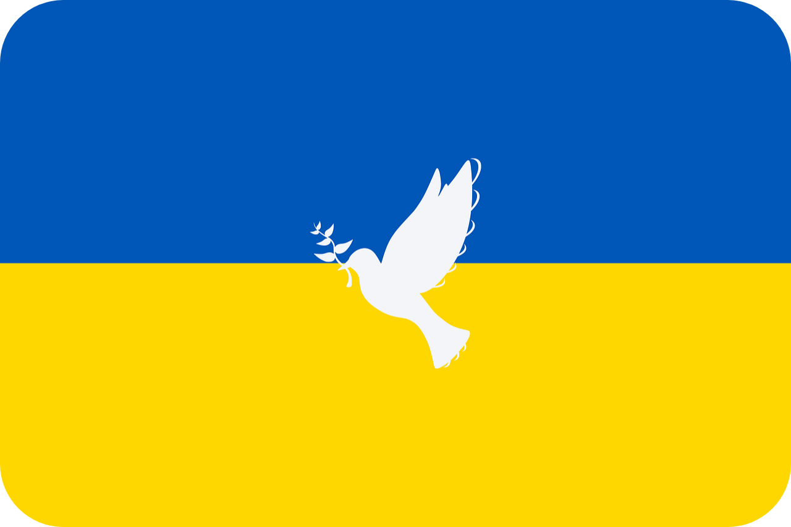
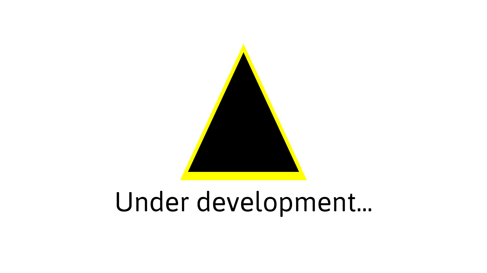

  

  <b><i>AndroVoid2D - An extension for Void2D Engine that allows you to write on PC, and run on Android! Right now AndroVoid2D is on development, but you can check status below! For now you can check <a href="https://github.com/xzripper/Void2D">Void2D</a> Engine!  Already developed: 0% (AndroVoid2D Java is cancelled. Look <a href="https://github.com/xzripper/CancelledAndroVoid2D">this</a>.)</b></i>

